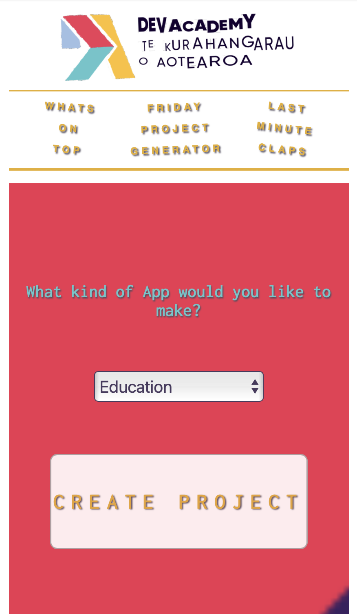

# Human Skills Generator
Tired of pretending to be a real human? Let our app do it for you! 

### But seriously...
A big part of Dev Academy Aotearoa is about introspection and growth as individuals and team members.. not just the tech! This app is a cheeky dig at that. Throughout the week, we encounter **real life situations** where we contribute as individuals and this app is designed to **automate those human interactions**. How cool!

## WHAT'S ON TOP GENERATOR
#### (1 x INTERNAL API, 2 x EXTERNAL APIs)
On a Friday morning the cohort gathers round in a seated circle and answers the question **What's on Top?**...

- Internal API calls a random preamble from a JSON file
  - ('I'm pretty tired today. I stayed up all night thinking about how to...')
- External API calls a snippet from the Corporate BS Generator API
  - (https://github.com/sameerkumar18/corporate-bs-generator-api)
  - ('...progressively morph customized bandwidth...')
- Hard-coded
  - ('...based on the fact that...')
- External API calls the Random Fact Generator API
  - (https://uselessfacts.jsph.pl)
  - ('...the expression to get fired comes from long ago...')

#### Generate!

## FRIDAY PROJECT GENERATOR
#### (2 x INTERNAL RESTFUL APIs, 1 x EXTERNAL RESTFUL API)
Every Thursday we would split off in to groups to braintstorm ideas for an app we could make in the next 24 hours. Bootcamp facilitators would often give us minimum requirements which would be in the inclusion of some tech we had recently learned...

- A form to select the type of app you would like to create
  - This calls the 'Bored API' to generate a random activity to cure boredom
  - Sample query: http://www.boredapi.com/api/activity?type=educational
  - Docs: https://boredapi.com

#### Generate!

- Hard-coded
  - ('Create a...')
- Internal API calls a random snippet to determine the style of app from a JSON file
  - ('...single page App...')
- Hard-coded
  - ('...that uses...')
- Internal API calls another random snippet to determine the tech requirement from a JSON file
  - ('...an external API...')
- Hard-coded
  - ('...to help you...')
- External API calls the Bored API
  - This API generates a random task to cure boredom
  - ('...learn to write with your non dominant hand')

## CLAP GENERATOR
#### (2 x INTERNAL RESTFUL APIs)
Every day at the end of Bootcamp we would circle up and the facilitators would ask a random question (e.g. 'What's a film that you love to watch over and over again?'). After we have gone round the circle and everyone has answered, whoever answered last would be expected to come up with a creative way of clapping to mark the end of the day. It wasn't always a clap either.

- Internal API calls a random snippet from a JSON file
  - ('Going right...')
- Internal API calls a random snippet from a JSON file
  - ('stomp one foot')

#### Generate!

